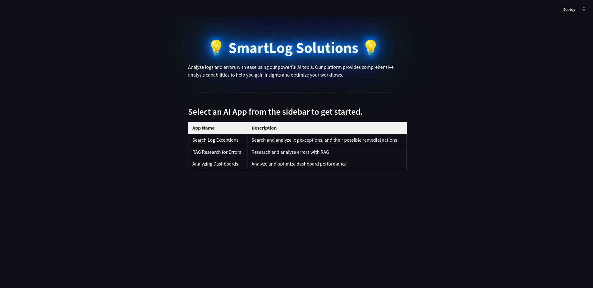

# 🚀 Log-Analyzer-LLM-App

Welcome to the **Log Analyzer App** repository! This project leverages **Streamlit** to provide a smart and interactive chatbot for analyzing logs, extracting insights, and interpreting monitoring dashboards. It aims to simplify the process of log analysis and help users make data-driven decisions through an intuitive interface. 

## 🔍 Overview

The Log Analyzer Chatbot is divided into three powerful modules:
1. **Log File Analysis**: Upload and analyze logs effortlessly.
2. **Retrieval-Augmented Generation (RAG)**: Get precise answers using the power of AI and vector databases.
3. **Multimodal Dashboard Analysis**: Analyze monitoring dashboards through images and extract critical insights.


---

## 📚 Table of Contents

- [✨ Components](#-modules)
  - [Component 1: Log File Analysis](#module-1-log-file-analysis)
  - [Component 2: Retrieval-Augmented Generation](#module-2-retrieval-augmented-generation)
  - [Component 3: Multimodal Dashboard Analysis](#module-3-multimodal-dashboard-analysis)
- [🗂️ Project Structure](#-project-structure)
- [⚙️ Installation](#%EF%B8%8F-installation)
- [🚀 Usage](#-usage)
- [🤝 Contributing](#-contributing)
- [📄 License](#-license)

---

## ✨ Components

### 🔧 Component 1: Log File Analysis
Effortlessly upload log files, and let the **Log Analyzer** do the rest! This module will:
- Detect all exceptions in the log file.
- Identify root causes of issues.
- Provide remedial actions in an easy-to-read tabular format.
  
Perfect for those who want quick insights from their logs without any hassle!

### 💡 Component 2: Retrieval-Augmented Generation
Harness the power of **RAG** with this module:
- A vector database is built using Wikipedia, enabling precise searches.
- Users can enter queries, and the app will find the most accurate results from the database.
  
Whether you need quick information or deep insights, the RAG-based chatbot has you covered.

### 🖼️ Component 3: Multimodal Dashboard Analysis
Take advantage of **image-based analysis** with this module:
- Upload images of monitoring dashboards.
- The app analyzes the visual data and highlights key information.
- Receive suggestions for necessary remedial actions based on the dashboard data.

A game-changer for visualizing trends and making sense of complex monitoring data!

---

## 🗂️ Project Structure

```
Log-Analyzer-LLM-App/
│
├── .env                        # Environment variables
├── apps/                       # Directory containing AI-related applications
├── data/                       # Directory containing sample data files
├── log_analyzer.py             # Main script for the log analyzer chatbot
├── log_analyzer-v0.py          # Older version of the log analyzer script
└── requirements.txt            # Required dependencies for the project
```

---

## ⚙️ Installation

Follow these steps to set up the Log Analyzer Chatbot on your local machine:

1. **Clone the repository**:
   ```bash
   git clone https://github.com/yourusername/log-analyzer-chatbot.git
   cd log-analyzer-chatbot/Log-Analyzer-LLM-App
   ```

2. **Create a virtual environment** and activate it:
   ```bash
   python -m venv venv
   source venv/bin/activate  # On Windows: venv\Scripts\activate
   ```

3. **Install the required dependencies**:
   ```bash
   pip install -r requirements.txt
   ```

---

## 🚀 Usage

Start the Streamlit app by running:
   ```bash
   cd ai_apps/
   streamlit run .\Home.py
   ```

This will open the app in your default web browser. Navigate through the available modules:

- **Log File Analysis**: Upload a log file to get detailed insights, including exceptions, root causes, and suggested fixes.
- **RAG-based Chatbot**: Enter queries to retrieve precise information from the vector database.
- **Multimodal Dashboard Analysis**: Upload an image of a monitoring dashboard to extract insights and actionable suggestions.

---

## 🤝 Contributing

Contributions are always welcome! 🎉

If you have any suggestions or improvements, feel free to:
1. **Fork** the repository.
2. **Create a new branch** (`git checkout -b feature/AmazingFeature`).
3. **Commit your changes** (`git commit -m 'Add some AmazingFeature'`).
4. **Push to the branch** (`git push origin feature/AmazingFeature`).
5. Open a **Pull Request**.

Let’s make this project even better together!

---

## 📄 License

This project is licensed under the MIT License. See the [LICENSE](LICENSE) file for more details.

---

🌟 **Enjoy using the Log Analyzer Chatbot?** Don't forget to give it a ⭐ star on [GitHub](https://github.com/aqibrehmanpirzada/Log-Analyzer-LLM-App/)! Happy analyzing! 😊

